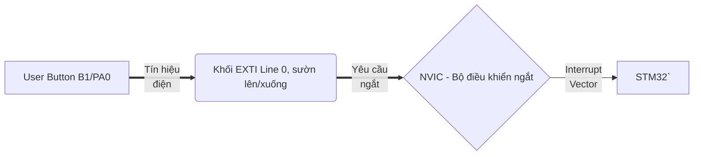
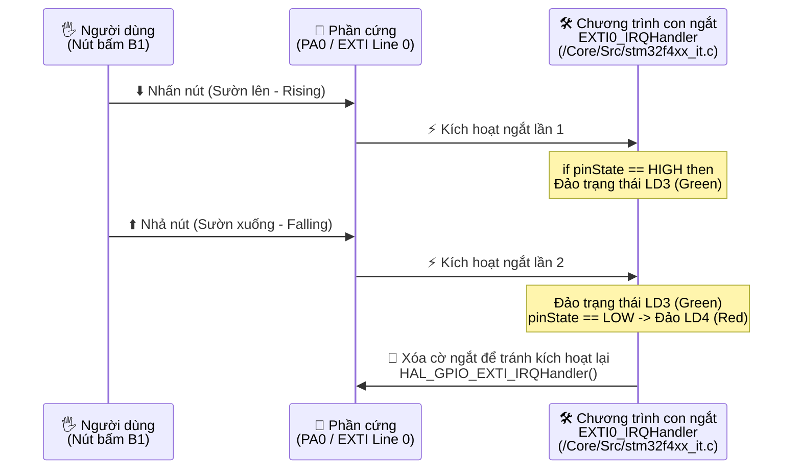

# EMBEDED SYSTEM / HỆ NHÚNG: Kit STM32F429 - và sự kiện ngắt do bấm nút

## Mục tiêu

Dự án này minh họa cách sử dụng ngắt ngoài (External Interrupt) trên Kit **STM32F429I-DISC1** để điều khiển 2 đèn **LED** thông qua nút bấm **User Button** màu xanh blue trên Dev-Kit.

## Video

## Tác dụng của chương trình

- **Phát hiện sự kiện**: Sử dụng ngắt để nhận biết cả hai cạnh (**Rising** và **Falling**) của nút bấm **User Button**
- **Phản hồi tức thời**:
  - Mỗi khi có thay đổi trạng thái nút bấm (**nhấn/rising edge** hoặc **nhả/falling edge**), led **LD3 (Green)** sẽ đảo trạng thái (Toggle).
  - Chỉ khi người dùng nhả nút/**falling edge**, led **LD4 (Red)** mới đảo trạng thái.
- **Hiệu quả**: CPU không cần kiểm tra nút bấm liên tục trong vòng lặp while(1), giúp tiết kiệm tài nguyên.

## Cấu hình trên STM32CubeMX (v2026)

Nút bấm **User Button** có sẵn trên Dev-Kit, gắn liền với chân **PA0** trên MCU STM32F429ZIT6, được đặt tên gợi nhớ là nút **B1**.

1. **GPIO Configuration**:
    - **PA0** (B1): Chọn chế độ **GPIO_EXTI0**. Cấu hình này làm core STM32F429I sẽ đón nhận sự kiện ngắt và gọi tới chương trình con ngắt.
    - **PG13** (LD3) & **PG14** (LD4): Chọn chế độ GPIO_Outputm. Cấu hình này để điều khiển Led qua 2 chân PIN này.
2. **GPIO Mode Details** đối với pin **PA0**:
    - Chế độ **External Interrupt Mode with Rising/Falling edge trigger detection**
    - Pull-up/Pull-down: **No pull-up and no pull-down**.
3. **NVIC Configuration** 
    - **EXTI line0 interrupt** = [v] (đánh dấu chọn Enable)
    - Thiết lập Priority/Độ ưu tiên phù hợp. Cứ để mặc định là 0,0
   > NVIC mới thực sự là module cứng đón nhận sự kiện ngắt, trước khi đi đến MCU STM32F429I. Nó đóng vai trò như bộ điều phối ngắt, bộ cầu giao tổng để cấm/cho phép ngắt được đi tiếp tới MCU phía sau.

## Sơ đồ mối quan hệ 3 bên giữa EXTI Line, NVIC và STM32

## Sơ đồ thuật toán

